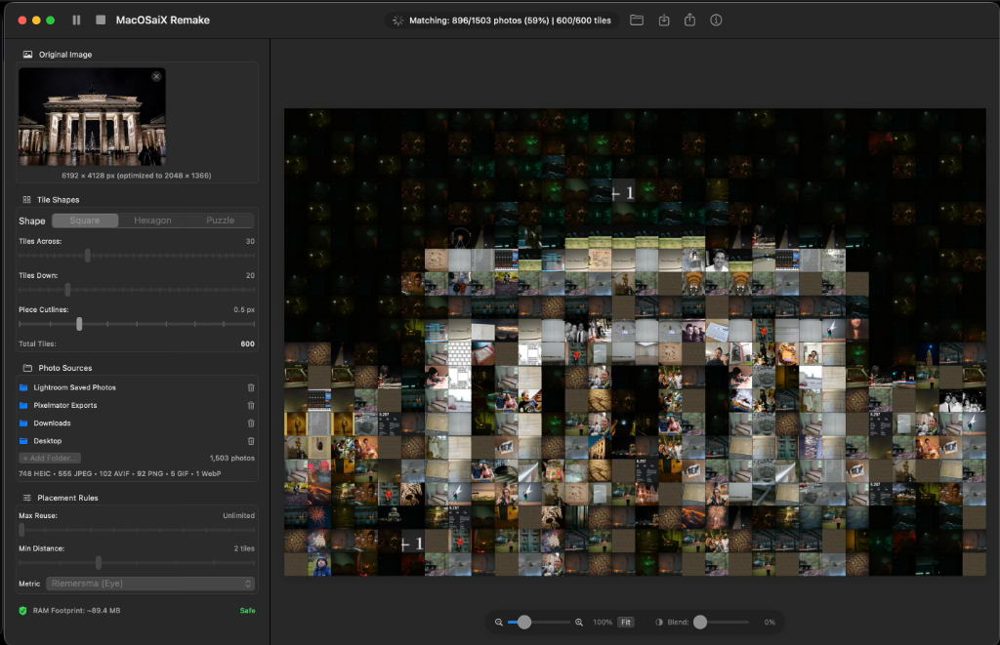

# MacOSaiX Remake (Apple Silicon Native)

<p align="center">
  
</p>

<p align="center">
  <strong>The classic Mac photomosaic creator revived and rebuilt for modern Apple Silicon.</strong><br>
  Originally created by <strong>Frank M. Midgley</strong> (2002–2009) for Mac OS X.<br>
  Modernized, re-engineered, and expanded with <strong>AI-assisted coding</strong> by <strong>Carlo Monjaraz-Tec</strong> (2026).
</p>

<p align="center">
  <a href="MANUAL.md"><strong>📖 Read the Full User Manual & Algorithmic Handbook</strong></a> |
  <a href="#quick-start"><strong>🚀 Quick Start</strong></a> |
  <a href="#feature-highlights"><strong>✨ Feature Highlights</strong></a> |
  <a href="#command-line-interface-macosaix-cli"><strong>💻 CLI</strong></a>
</p>

---

> [!NOTE]
> **Complete Documentation**: For step-by-step GUI tutorials, parameter recipes, and full mathematical explanations of quadtree decomposition and OKLab color science, visit the [**Comprehensive User Manual (MANUAL.md)**](MANUAL.md).

---

## Feature Highlights

### ⚡ Apple Silicon Native Performance
- **Fluid & Freeze-Free**: Image decoding, mask rasterization, and candidate tile evaluation run asynchronously in detached background worker tasks (`Task.detached`), maintaining a steady 60–120 FPS UI.
- **Hardware Codec Acceleration**: Native support for **AVIF**, **HEIC/HEIF** (with hardware EXIF auto-rotation), **WebP**, JPEG, PNG, TIFF, and BMP via Apple's `ImageIO` framework.
- **Memory Safety Guard**: 10-bit and HDR surfaces are normalized to contiguous 8-bit sRGB buffers. An integrated RAM pre-flight check prevents memory faults even during 12,000+ pixel ultra-HD exports.

### 🖥️ Modern SwiftUI + AppKit Experience (`MacOSaiX Remake.app`)
- **Faithful 2-Pane Interface**: Classic sidebar controls paired with a live progressive canvas and interactive original-vs-mosaic blend slider.
- **2D Trackpad Navigation**: Glide across high-resolution mosaics with native macOS inertia and momentum; pinch-to-zoom (25% to 400%) or `⌘ + Scroll Wheel`.
- **Top-Right Playback Toolbar**: Start/Pause (`⌘R`), Stop (`⌘.`), and Export (`⌘E`) conveniently accessible at the top right corner.
- **Lightweight Project Files (`.macosaix`)**: Save complete mosaic sessions as compressed packages (~30–60 KB). Preserves target paths, source directories, and matched tiles without duplicating gigabytes of photos. Double-click in Finder to resume instantly.

### 🔲 Adaptive Multi-Resolution Quadtree Tiling
- **Whole Canvas Quadtree**: Single top-down root decomposition recursing across the entire image for dramatic, macro-scale compositions.
- **Julia Extrema Range**: Ultra-sensitive homogeneity criterion (`max - min < threshold`) inspired by Julia's `ImageSegmentation.jl` that isolates razor-thin high-contrast contours.
- **RGB Color Range**: Simultaneous multi-channel Chebyshev color divergence detection.
- **Variance / Hybrid Decomposition**: $O(1)$ constant-time luminance variance via Crow (1984) Summed-Area Tables combined with Sobel gradient density.
- **2:1 Balanced Transitions & Min Tile Floor**: Enforces smooth multi-scale transitions between neighbors while respecting strict minimum tile size limits (4px to 48px).

### 🧩 True Mathematical Tessellations
- **Interlocking Jigsaw Puzzles (`puzzle`)**: Mathematically generated cubic Bezier tabs and sockets that interlock seamlessly across adjacent pieces. Fully adjustable waviness and cutline styling.
- **Hexagonal Honeycombs (`hex`)**: Modern, architectural honeycomb lattice.
- **Classic Rectangles (`rect`)**: Timeless rectangular grid for maximum constituent photo visibility.

### 🎨 Human Eye Color Matching & Advanced Placement
- **Riemersma Perceptual Metric**: Weights RGB color differences using human eye spectral sensitivities rather than simple Euclidean distance.
- **Reinhard OKLab Color Transfer**: Real-time slider shifting constituent photo palette distributions towards target tiles inside modern OKLab space without washing out contrast.
- **Edge-Aware Directional Matching (Sobel HOG)**: Aligns constituent photo line flow with target contours using 8-bin orientation histograms.
- **Placement Controls**: Enforce "No Duplicates" (`--max-reuse 1`) or space identical photos apart using minimum grid distance constraints.

---

## Feature Comparison Matrix

| Capability | Classic MacOSaiX (2002–2009) | MacOSaiX Remake (2026) |
| :--- | :---: | :---: |
| **Architecture** | 32-bit PowerPC / Intel (NeXTSTEP/Cocoa) | Native Apple Silicon ARM64 (macOS 14+) |
| **GUI Framework** | Legacy Objective-C Nib / AppKit | Modern SwiftUI + AppKit |
| **Navigation** | Basic scroll bars | 2D Inertial Trackpad Glide & Pinch-to-Zoom |
| **Modern Formats** | JPEG, PNG, TIFF | AVIF, HEIC/HEIF, WebP, JPEG, PNG, TIFF, BMP |
| **Adaptive Tiling** | None (Uniform grids only) | **Whole Canvas, Julia Extrema, RGB Range, Variance** |
| **Tiling Shapes** | Rectangles, Hexagons, Puzzles | Rectangles, Hexagons, Puzzles, **Adaptive Quadtrees** |
| **Color Transfer** | None (Opacity blend only) | **Reinhard Statistical Transfer in OKLab Space** |
| **Edge Matching** | None | **Sobel HOG Directional Vector Alignment** |
| **Project Packaging**| Uncompressed XML plist | **Zipped `.macosaix` Package (~40 KB)** |
| **Headless CLI** | Third-party / Limited | **Integrated `macosaix-cli`** |

---

## Quick Start

### Launching the Desktop Application

A pre-built, codesigned application is included in the repository:

```bash
open "MacOSaiX Remake.app"
```

To build and package from source anytime:
```bash
cd macosaix-modern
swift build -c release
bash scripts/bundle_app.sh
open "../MacOSaiX Remake.app"
```

---

## Command-Line Interface (`macosaix-cli`)

For server automation, batch rendering, or headless environments:

### 1. Build the CLI
```bash
cd macosaix-modern
swift build -c release
```
The binary will be located at `macosaix-modern/.build/release/macosaix-cli`.

### 2. Generate an Adaptive Mosaic
```bash
macosaix-cli \
  --target "~/Pictures/Portrait.heic" \
  --sources "~/Pictures/Photos" \
  --shape quadtree \
  --quadtree-algo whole \
  --quadtree-depth 4 \
  --quadtree-thresh 0.15 \
  --quadtree-min-tile 8 \
  --color-transfer 0.35 \
  --output "~/Desktop/adaptive_mosaic.png"
```

*For complete CLI flag tables and automation recipes, refer to the [User Manual](MANUAL.md#6-command-line-interface-macosaix-cli).*

---

## Project Structure

```
macosaix/
├── MacOSaiX Remake.app/     # Bundled, codesigned macOS application
├── MANUAL.md                # Comprehensive user manual & algorithmic guide
├── README.md                # Project overview & feature highlights
├── docs/                    # Screenshots & documentation assets
└── macosaix-modern/         # Modern Apple Silicon codebase
    ├── Package.swift        # Swift Package Manager manifest
    ├── scripts/             # App bundle packaging scripts
    └── Sources/
        ├── MacOSaiXCore/    # Objective-C engine (shapes, quadtree, matcher)
        ├── MacOSaiXKit/     # Swift engine (ImageIO, solver, project zip)
        ├── MacOSaiXApp/     # SwiftUI + AppKit frontend (sidebar, canvas)
        └── macosaix-cli/    # High-performance command-line tool
```

---

## Credits & License

- **Modern Revival & Engineering**: **Carlo Monjaraz-Tec** (AI-assisted coding, 2026).
- **Original Software & Mathematical Concepts**: **Frank M. Midgley** (MacOSaiX 1.x – 2.x, 2002–2009).

### License

This project is licensed under the **GNU General Public License v3.0 (GPL-3.0)**. See the [LICENSE](LICENSE) file for the full text.

- **Copyleft Protection**: Any derivative works, modifications, or applications incorporating this code must also be licensed under the GNU GPL-3.0 with source code made available.
- **Historical Attribution**: The original MacOSaiX legacy codebase (`MacOSaiX/`, `Standard Plugins/`) and artwork remain copyright © 2001–2009 Frank M. Midgley and are preserved here for historical reference.
